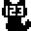
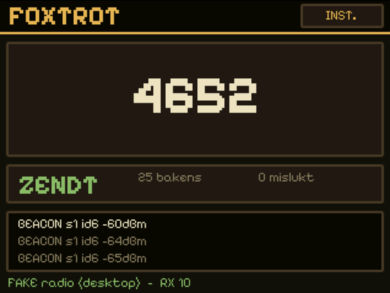

<div align="center">
  

# Foxtrot

**Turn a Fri3d Camp 2026 badge into a standalone LoRa fox beacon.**

</div>



Foxtrot is a [MicroPythonOS](https://github.com/MicroPythonOS/MicroPythonOS)
app for the Fri3d foxhunt game. It replaces dedicated transmitter hardware:
the badge broadcasts LoRa beacons, validates a hunter's claim locally, and
issues proof of a successful find. No Wi-Fi, network, or central service is
required.

## Highlights

- **Ready to hunt:** starts transmitting automatically as **Vos** (fox).
- **Standalone validation:** checks the four-digit one-time code and an
  RSSI proximity threshold before issuing proof.
- **Useful diagnostics:** shows received packet types, signal strength,
  validation results, sent beacons, failed sends, and radio resets.
- **Hard to spot:** keeps the badge's NeoPixels dark, so hunters need their
  radios rather than their eyes.
- **Accident resistant:** creature selection and the transmit switch live
  behind the small **INST.** button; transmit is enabled again after every
  restart.

## Playing

1. Launch Foxtrot on the fox badge. It begins broadcasting immediately.
2. Hide the badge and let hunters track its LoRa signal.
3. A hunter enters the large four-digit code shown on Foxtrot's screen in the
   [Fri3d Foxhunt-app](https://github.com/fdb/fri3d-foxhunt).
4. Foxtrot accepts a nearby, valid claim and sends the hunter its proof.

The main screen deliberately never reveals the selected creature's secret
name. Open **INST.** to choose a creature or temporarily stop transmitting.

## Run and develop

The desktop emulator currently supports macOS. The launcher script downloads
the prebuilt MicroPythonOS package on first use and connects Foxtrot's fake,
scripted radio.

```sh
scripts/run_on_mac.sh
```

To deploy the working tree to a USB-connected badge:

```sh
scripts/deploy_to_badge.sh --start
```

The deploy script requires [`uv`](https://docs.astral.sh/uv/) and uses
`mpremote` without modifying the badge firmware. It refuses dirty working trees
by default; pass `--force` only when intentionally testing uncommitted code.

Useful contributor commands:

```sh
scripts/format.sh                 # Format Python and JSON
scripts/format.sh --check         # Check formatting
uvx pytest tests/ -q              # Run the test suite
scripts/build_mpk.sh              # Build the BadgeHub .mpk in dist/
```

## Radio and protocol

Foxtrot implements the repository's
[single-beacon foxhunt specification](foxhunt-spec-minimal.md). It uses
869.4625 MHz, SF7, 125 kHz bandwidth, coding rate 4:5, and the private LoRa sync
word. Beacons transmit at +14 dBm in bursts of one packet every 250 ms; the
configured silent interval keeps the overall duty cycle at 9.8%.

Claims must match the current one-time code and arrive at or above −85 dBm.
Foxtrot then replies directly with three `PROOF` packets. The fox is
the sole authority for a find.

These defaults target the event's EU 869 MHz deployment. Check the radio rules
and permitted frequencies for your location before transmitting elsewhere.

## Hardware behaviour

On a badge, Foxtrot always uses the real SX1262 radio. If the chip does not
respond, the footer reports the problem while the app resets and reinitialises
it with a bounded retry delay. The fake radio is available only in the desktop
emulator, so a hardware failure can never look like a successful transmission.
